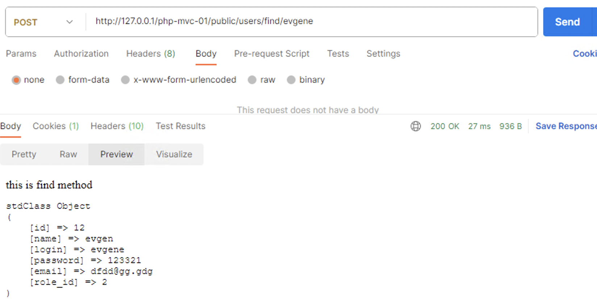
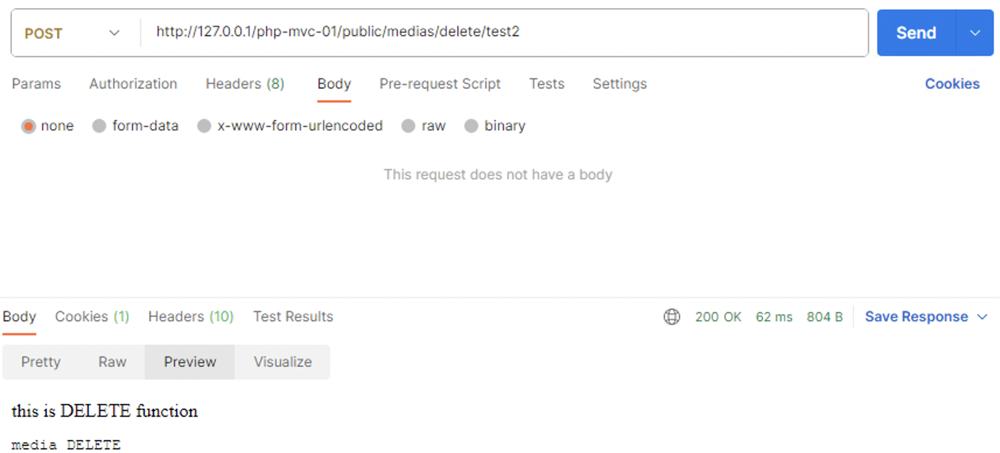

# Тестування працездатності системи

## Тестування REST API

### Робота з таблицею User 

#### Отримати всіх користувачів

#### Отримати користувача за його name

#### Додати нового користувача

#### Видалити користувача за його name

### Робота з таблицею Media

#### Отримати медіа за його name

#### Додати нову медіа

#### Видалити медіа за його name

### Робота з таблицею Origin

#### Отримати усі Origin

#### Отримати Origin за його name

#### Додати новий Origin

#### Видалити Origin за його name

### Робота з таблицею Request

#### Отримати усі запити

#### Отримати запит за його id

#### Додати новий запит

#### Видалити запит за його id

### Робота з таблицею Role

#### Отримати усі ролі

#### Отримати роль за її name

#### Додати нову роль

#### Видалити роль за її name

